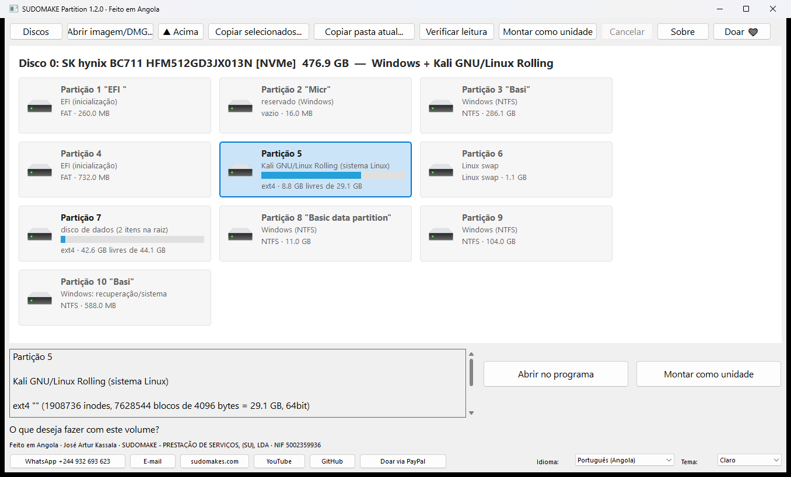
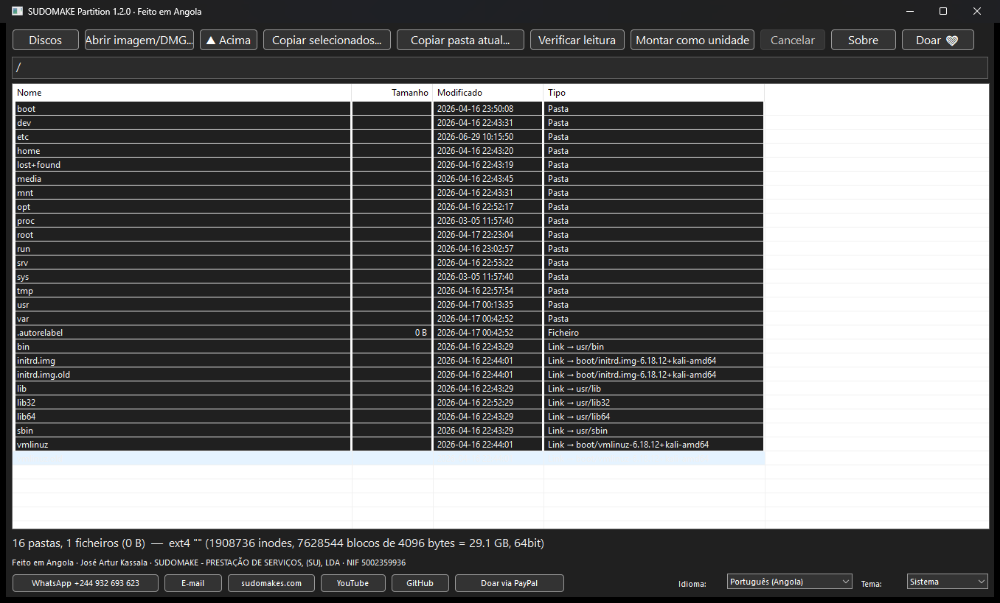

<h1 align="center">SUDOMAKE Partition</h1>

<p align="center"><b>Ler, copiar e montar discos de Mac (APFS, HFS+) e Linux (ext4, ext3, ext2, LVM) no Windows — grátis, código aberto, feito em Angola 🇦🇴</b><br>
<i>Read, copy and mount Mac (APFS, HFS+) and Linux (ext4/ext3/ext2, LVM) disks on Windows — free, open source, made in Angola.</i></p>

<p align="center">
<a href="https://github.com/arturjose0/sudomake-partition/releases/latest"></a>
<a href="https://github.com/arturjose0/sudomake-partition/actions"></a>
<a href="LICENSE"></a>


</p>

<p align="center">
<a href="https://github.com/arturjose0/sudomake-partition/releases/latest"><b>⬇ Baixar / Download</b></a> ·
<a href="#-interface-gráfica">Como usar</a> ·
<a href="#-linha-de-comando-sudomake-partitionexe">Linha de comando</a> ·
<a href="#-perguntas-frequentes">FAQ</a> ·
<a href="#-english">English</a> ·
<a href="#-français">Français</a> ·
<a href="#-español">Español</a> ·
<a href="#-apoie-o-desenvolvedor-doação">Doar ❤</a>
</p>

---

**SUDOMAKE Partition** é um programa para **Windows 10/11** que abre discos formatados pelo
**macOS** (APFS e HFS+/HFSX) e pelo **Linux** (ext2, ext3, ext4, inclusive dentro de LVM) e mostra
os ficheiros como no Explorador: você navega, copia o que quiser para o Windows, ou monta o disco
como uma letra de unidade (`Z:`). Serve para o disco interno retirado de um MacBook, iMac ou PC com
Ubuntu/Debian/Kali/Fedora, para discos externos e pen drives formatados no Mac ou no Linux e para
imagens de disco (`.img`, `.raw`, `.dd`, `.dmg`). **Não precisa de driver, não precisa de senha
para discos comuns e nunca escreve no disco de origem.**

Foi desenvolvido em **Angola** por **José Artur Kassala** (SUDOMAKE - PRESTAÇÃO DE SERVIÇOS, (SU),
LDA) e é gratuito e de código aberto (licença MIT). Se ele o ajudar a recuperar os seus ficheiros,
[considere uma doação](#-apoie-o-desenvolvedor-doação) de qualquer valor.

<p align="center"></p>

## ✨ O que ele faz

| Recurso | |
|---|---|
| Ler **APFS** (macOS 10.13 até ao mais recente), com todos os volumes do container (Sistema, Dados, Preboot…), volumes selados e ficheiros comprimidos (decmpfs: zlib, LZVN, LZFSE) | ✔ |
| Ler **HFS+ / HFSX** (Mac OS Extended, Time Machine antigo, discos externos de Mac), hard links, HFS+ dentro de wrapper HFS e Apple Partition Map | ✔ |
| Ler **ext4, ext3, ext2** (Ubuntu, Debian, Kali, Mint, Fedora, RHEL…): extents, blocos indirectos, `inline_data`, `64bit`, `metadata_csum`, ficheiros esparsos, pastas grandes | ✔ |
| **LVM2**: volumes lógicos lineares (instalações "usar LVM") aparecem como partições extra | ✔ |
| Imagens **DMG** (UDIF: zlib, bzip2, ADC, LZFSE, LZMA) sem converter, imagens brutas `.img`/`.raw`/`.dd`, GPT, MBR, APM | ✔ |
| **Detecta o sistema** de cada partição: "Ubuntu 22.04.4 LTS", "Kali GNU/Linux Rolling", "macOS 12.5", "Windows (NTFS)", "EFI", "Linux swap", "Backup do Time Machine", "disco de dados"… | ✔ |
| **Interface gráfica** com os discos em azulejos (como "Este PC"), barra de espaço usado, tema claro/escuro/sistema e 4 idiomas (Português-AO, English, Français, Español) | ✔ |
| **Copiar** ficheiros ou pastas inteiras com progresso, cancelamento, retomada (o que já existe é saltado), registo de erros e datas preservadas | ✔ |
| **Montar como unidade** do Windows (`Z:`), somente leitura, via driver Dokan 2 — abre fotos, vídeos, PDFs directamente do disco em qualquer programa; **vários discos montados ao mesmo tempo**, cada um com a sua letra | ✔ |
| **Copiar disco completo** para outro disco, com verificação prévia do espaço livre no destino (recusa se não couber) | ✔ |
| **Actualização automática**: os discos ligados ou removidos aparecem/desaparecem sozinhos, e o espaço é reavaliado periodicamente | ✔ |
| **Verificar leitura**: lê tudo sem gravar nada, para saber se o disco está íntegro | ✔ |
| **Linha de comando** para scripts e cópias grandes (`discos`, `info`, `ls`, `arvore`, `cat`, `copiar`, `verificar`, `montar`) | ✔ |
| **Instalador** por utilizador ou para todo o sistema, que instala sozinho a única dependência opcional (Dokan); versão portátil em zip | ✔ |
| Somente leitura: **nunca** grava, repara ou altera o disco de origem | ✔ |
| XFS, Btrfs, F2FS | ✘ detectados, ainda não lidos |
| Discos cifrados: FileVault (APFS), LUKS, eCryptfs, fscrypt, Core Storage | ✘ precisam da chave; não suportados |
| Macs com chip T2 ou Apple Silicon (SSD soldado e cifrado por hardware) | ✘ o disco não é legível fora do Mac |
| Snapshots APFS, RAID/LVM em vários discos, DMG cifrado, sparsebundle, HFS clássico | ✘ |

## ⬇ Baixar e instalar

Na página de [**Releases**](https://github.com/arturjose0/sudomake-partition/releases/latest)
(Windows 10/11 de 64 bits, sem nenhum requisito prévio):

* **`sudomake-partition-setup-x.y.z.exe`** (recomendado) — instalador em português, inglês,
  francês e espanhol. Pergunta se instala só para o seu utilizador ou para todos os utilizadores,
  cria atalhos e um desinstalador, e **verifica as dependências**: se o driver Dokan 2 (usado só
  para montar discos como unidade) não estiver instalado, descarrega-o da página oficial (~9 MB)
  e instala-o. Funciona num Windows acabado de instalar; os executáveis não dependem de runtimes.
* **`sudomake-partition-windows-x64.zip`** — versão portátil: `SudomakePartition.exe`
  (interface), `sudomake-partition.exe` (linha de comando) e este manual. Descompacte e execute.

Ao abrir, o programa pede permissão de **Administrador** (é obrigatório no Windows para ler um
disco físico). Sem essa permissão só as imagens de disco funcionam.

## 🖥 Interface gráfica

1. **Ecrã inicial (branco, ou escuro se preferir):** cada disco ligado ao computador aparece
   como um título ("Disco 1: WD Green 480GB [USB] — Windows + Ubuntu 22.04") e as suas partições
   como azulejos, no estilo de "Este PC" do Windows: ícone da unidade, nome, sistema encontrado,
   barra de espaço usado e sistema de ficheiros. Volumes APFS e volumes lógicos LVM aparecem como
   azulejos próprios. Ligue ou retire um disco e o ecrã actualiza-se sozinho.
2. **Clique num azulejo** legível (Mac ou Linux): a barra de cima passa a mostrar só os botões
   que fazem sentido para ele:
   * **Abrir no programa** (ou dois cliques no azulejo) — navega pelas pastas (dois cliques para
     entrar, **▲ Acima** para voltar, dois cliques num ficheiro mostram tamanho, datas e
     permissões) e copia: **Copiar selecionados…** (aparece quando há linhas marcadas; Ctrl/Shift
     para várias), **Copiar pasta atual…** ou **Verificar leitura**. O progresso aparece na barra;
     **Cancelar** interrompe. No fim, um resumo mostra os erros, que ficam também em
     `sudomake-partition-log.txt` no destino.
   * **Montar como unidade** — o volume vira uma letra (`Z:`), somente leitura, e o Explorador
     abre-se nela; o azulejo ganha a etiqueta da letra. Pode montar **vários discos ao mesmo
     tempo**, cada um com a sua letra. Seleccione o azulejo e clique em **Desmontar Z:** antes
     de retirar o disco; fechar o programa desmonta todos. Precisa do driver
     [Dokan 2](https://github.com/dokan-dev/dokany/releases) (o instalador trata disso).
   * **Copiar disco completo…** — copia todo o conteúdo do volume para uma pasta noutro disco.
     Antes de começar, o programa compara o espaço ocupado com o espaço livre no destino e
     **recusa a cópia se não couber**, mostrando quanto falta.
   * **Verificar leitura** — lê o volume inteiro sem gravar nada, para saber se está íntegro.
3. **Abrir imagem/DMG…** adiciona um ficheiro `.img`, `.raw`, `.dd` ou `.dmg` ao ecrã inicial
   (também pode arrastar a imagem para cima do `SudomakePartition.exe`).
4. **Idioma** e **Tema** ficam no canto inferior direito. O tema por defeito segue o Windows
   (claro ou escuro); a escolha fica guardada.
5. **Sobre** mostra o que o programa faz, quem o desenvolveu e como apoiar; **Doar ❤** mostra
   os dados de doação. Os botões do rodapé abrem o **WhatsApp**, o **e-mail**, o **site**, o
   **YouTube**, o **GitHub** e o **PayPal** com um clique.

<p align="center"></p>

### Precisa de senha?

**Não, para discos comuns.** A senha de login do Linux ou do macOS só protege a sessão; os
ficheiros ficam gravados em claro no disco e as permissões (`drwx------`) são aplicadas apenas
pelo sistema em execução. Lendo o disco directamente, tudo é acessível: `/home/<utilizador>` e
`/Users/<utilizador>` abrem normalmente.

A senha só faria diferença se o disco tivesse sido **cifrado de propósito**: FileVault no Mac,
LUKS ("cifrar a nova instalação" no Ubuntu) ou pastas pessoais eCryptfs (Ubuntu antigo, pasta
`.ecryptfs`). Nesses casos o programa mostra a partição como cifrada e não a abre, mesmo com a
senha.

### Onde estão os ficheiros do utilizador?

* macOS 10.15 ou mais novo (APFS): volume **"Macintosh HD - Data"** (função *Dados*), pasta
  `/Users/<nome>`. É o volume escolhido automaticamente.
* macOS 10.13–10.14 (APFS) ou HFS+: volume único, pasta `/Users/<nome>`.
* Backups do Time Machine em HFS+: `/Backups.backupdb/<Mac>/<data>/…`.
* Linux: `/home/<nome>`. Com LVM, escolha o volume lógico "root" (ou o que contém `/home`);
  o ecrã inicial diz qual é. Uma partição `/home` separada aparece como outra partição ext4.

## ⌨ Linha de comando (sudomake-partition.exe)

Abra o **PowerShell ou Prompt como Administrador** (ou use
[`abrir-como-admin.cmd`](abrir-como-admin.cmd), que faz isso e já lista os discos).

```text
sudomake-partition discos
sudomake-partition info disco:1
sudomake-partition ls disco:1 /Users
sudomake-partition ls disco:1 /home/joao -l
sudomake-partition arvore disco:1 /home --nivel 2
sudomake-partition copiar disco:1 /Users/joao/Documents D:\Recuperado
sudomake-partition copiar disco:1 /home/joao D:\Recuperado
sudomake-partition copiar disco:1 / D:\Recuperado\DiscoInteiro
sudomake-partition verificar disco:1 /home/joao
sudomake-partition montar disco:1 X:
sudomake-partition desmontar X
```

`disco:1` é o número mostrado por `discos` (o mesmo do Gestão de Discos do Windows). Também
aceita `\\.\PhysicalDrive1`, o caminho de uma imagem bruta (`C:\disco.img`) ou de um DMG.
Ao copiar uma pasta, ela é criada dentro do destino (`D:\Recuperado\joao`); ao copiar a raiz
`/`, o conteúdo vai directo para o destino. Em nomes com acentos no Prompt, corra antes
`chcp 65001`.

| Comando | O que faz |
|---|---|
| `discos` | lista os discos físicos, as partições e o sistema encontrado em cada uma |
| `info <origem>` | partições, container APFS, volumes LVM e detalhes do sistema de ficheiros |
| `ls <origem> [caminho] [-l]` | lista uma pasta |
| `arvore <origem> [caminho] [--nivel N]` | mostra a árvore de pastas |
| `cat <origem> <ficheiro>` | envia um ficheiro para a saída padrão |
| `copiar <origem> <caminho> <destino>` | copia um ficheiro ou pasta (recursivo) |
| `verificar <origem> [caminho]` | lê todos os ficheiros sem gravar nada |
| `hex <origem> [offset] [tamanho]` | mostra bytes brutos do disco (diagnóstico) |
| `montar <origem> [letra]` | monta como unidade do Windows via Dokan (Ctrl+C desmonta) |
| `desmontar <letra>` | desmonta uma unidade montada pelo programa |

| Opção | Efeito |
|---|---|
| `-p N`, `--particao N` | usa a partição N (padrão: primeira Mac; senão, primeira Linux) |
| `-v N`, `--volume N` | usa o volume APFS N (padrão: o volume "Dados") |
| `-l` | listagem detalhada (permissões, bytes, data, `C` = comprimido) |
| `--sobrescrever` | regrava ficheiros que já existem no destino |
| `--links` | grava um `nome.symlink.txt` com o destino de cada link simbólico |
| `--verboso` | mostra cada ficheiro copiado |
| `--simular` | só percorre e conta, não grava nada |
| `--forcar` | tenta abrir um volume marcado como cifrado |
| `--nivel N` | profundidade do comando `arvore` (padrão 3) |

Erros durante a cópia (ficheiro corrompido, sector ilegível…) não interrompem o processo: são
mostrados e gravados em `sudomake-partition-log.txt` no destino. Repetir o comando continua de
onde parou.

## ❓ Perguntas frequentes

**O Windows diz que o disco precisa de ser formatado. Perco os dados?** Não formate. O Windows
não reconhece APFS, HFS+ nem ext4 e por isso sugere formatar. Feche o aviso e abra o disco com
o SUDOMAKE Partition.

**Ler um disco de MacBook no Windows / abrir disco de Mac no PC?** Ligue o disco (por adaptador
USB/SATA ou NVMe, ou o disco externo), abra o programa, clique no volume "Macintosh HD - Data"
e copie a pasta `/Users/<nome>`.

**Abrir partição ext4 do Ubuntu/Kali no Windows?** Abra o programa, clique na partição marcada
"Ubuntu 22.04…" / "Kali GNU/Linux…" e copie `/home/<nome>`. Também pode montá-la como `Z:`.

**Funciona com pen drive ou HD externo formatado no Mac?** Sim (APFS, HFS+, "Mac OS
Extended"). Com FileVault/cifrado, não.

**É seguro?** É somente leitura: o programa nunca escreve, repara nem monta em modo de escrita.
O disco fica exactamente como estava.

**Precisa de internet?** Não. Só o instalador descarrega o Dokan (opcional) se ele faltar.

**Alternativas pagas** (Paragon HFS+/APFS for Windows, MacDrive, Linux Reader, TransMac,
HFSExplorer) fazem parte disto; o SUDOMAKE Partition é gratuito, aberto, lê Mac **e** Linux,
mostra qual sistema está em cada partição e não instala drivers para ler ou copiar.

## ❤ Apoie o desenvolvedor (doação)

O SUDOMAKE Partition é gratuito, de código aberto e **feito em Angola**. A doação **não é
obrigatória**; se o programa o ajudou a recuperar os seus ficheiros, qualquer valor é bem-vindo:

| | |
|---|---|
| **PayPal** | [josearturkassala0@hotmail.com](https://www.paypal.com/cgi-bin/webscr?cmd=_donations&business=josearturkassala0%40hotmail.com&item_name=SUDOMAKE+Partition&currency_code=USD) |
| **Transferência Express (Angola)** | **932693623** |

Depois de doar, envie o comprovativo pelo [**WhatsApp +244 932 693 623**](https://wa.me/244932693623)
ou por [**e-mail**](mailto:josearturkassala0@hotmail.com?subject=SUDOMAKE%20Partition) para
podermos agradecer. E siga o canal no **YouTube**: <https://www.youtube.com/@arturjose0>.

## 👤 Créditos

| | |
|---|---|
| **Desenvolvedor** | José Artur Kassala |
| **Empresa** | SUDOMAKE - PRESTAÇÃO DE SERVIÇOS, (SU), LDA · NIF 5002359936 |
| **País** | Angola 🇦🇴 — *made in Angola / feito em Angola* |
| **WhatsApp** | [+244 932 693 623](https://wa.me/244932693623) |
| **E-mail** | [josearturkassala0@hotmail.com](mailto:josearturkassala0@hotmail.com) |
| **Site** | <https://sudomakes.com> |
| **YouTube** | <https://www.youtube.com/@arturjose0> |
| **GitHub** | <https://github.com/arturjose0> |
| **Doação** | PayPal `josearturkassala0@hotmail.com` · Express `932693623` (qualquer valor) |
| **Licença** | [MIT](LICENSE) — use, copie, modifique e distribua livremente |

## 🛠 Compilar a partir do código

Requisitos: [Rust](https://rustup.rs) 1.80 ou mais novo. Não é preciso o Visual Studio se usar
a toolchain GNU (traz o próprio linker); a toolchain MSVC também serve (é a usada pelo GitHub
Actions, com CRT estático configurado em `.cargo/config.toml`). Basta correr
[`build.cmd`](build.cmd) ou:

```text
rustup toolchain install stable-x86_64-pc-windows-gnu
cargo +stable-x86_64-pc-windows-gnu build --release
cargo +stable-x86_64-pc-windows-gnu test
```

Os executáveis ficam em `target\release\SudomakePartition.exe` (interface) e
`target\release\sudomake-partition.exe` (linha de comando). O instalador é gerado com o
[Inno Setup 6](https://jrsoftware.org/isinfo.php):
`ISCC.exe installer\sudomake-partition.iss` → `dist\sudomake-partition-setup-x.y.z.exe`.
O GitHub Actions compila, testa e publica tudo automaticamente em cada *tag* `v*`.
Guia passo a passo para quem vai mexer no código (executar, editar, publicar, instalador):
[GUIA-DO-DESENVOLVEDOR.md](GUIA-DO-DESENVOLVEDOR.md).

## 🔬 Como funciona

1. Abre `\\.\PhysicalDriveN` com leituras alinhadas ao sector (ou um ficheiro de imagem; DMGs
   são descomprimidos bloco a bloco sob demanda) e interpreta a tabela de partições (GPT, MBR,
   APM). Identifica o sistema de ficheiros pelas assinaturas (`NXSB` para APFS, `H+`/`HX` para
   HFS+, `0xEF53` para ext, `LABELONE` para LVM…). Partições LVM são expandidas lendo os
   metadados em texto do grupo de volumes.
2. **APFS**: localiza o checkpoint mais recente com checksum Fletcher-64 válido, percorre o
   object map do container, lê os superblocos dos volumes, o object map do volume e a árvore B
   do sistema de ficheiros (inodes, entradas de pasta, atributos estendidos, extents). Ficheiros
   com `com.apple.decmpfs` são descomprimidos de forma transparente.
3. **HFS+**: lê o cabeçalho do volume e as árvores B de catálogo, extents e atributos,
   resolvendo extents adicionais e hard links.
4. **ext2/3/4**: lê o superbloco, os descritores de grupo (inclusive `meta_bg`), os inodes, as
   árvores de extents ou os blocos indirectos, dados inline e as entradas de pasta.
5. A detecção do sistema procura `/etc/os-release`, `SystemVersion.plist`, `/Users`, `/home`,
   `/Backups.backupdb`, e a finalidade das outras partições vem do tipo GPT/assinatura (EFI,
   Windows, recuperação, swap, LUKS…).
6. A cópia lê em blocos de 1 MB, grava com nome válido no Windows (caminhos longos via `\\?\`)
   e ajusta a data de modificação, numa thread separada com progresso e cancelamento.
7. **Montagem**: o volume é servido por uma thread própria (`fsservice.rs`); `dokan.rs` carrega
   a `dokan2.dll` em tempo de execução e implementa as callbacks do Dokan sobre esse serviço.

Escrito em **Rust**, com `flate2` (zlib), `lzfse_rust`, `bzip2-rs`, `lzma-rs`,
`unicode-normalization` (nomes NFD), `native-windows-gui` e `winapi`. Descodificadores LZVN e ADC
próprios; ligação ao Dokan feita à mão a partir do `dokan.h` 2.3.1.

## ✅ Como foi validado

Conteúdo comparado byte a byte com o extraído pelo 7-Zip 26 (que também lê APFS, HFS+ e ext):
imagens de teste do dfvfs/plaso (`apfs.raw`, `apfs.dmg`, `hfsplus.raw`, `hfsplus_zlib.dmg`,
`apm.dmg`); `BaseSystem.dmg` do macOS Monterey (45.670 ficheiros) e High Sierra (35.473);
DMG do Safari Technology Preview (HFSX em DMG LZFSE, 219 MB idênticos); imagens ext4/ext3/ext2
criadas com `mke2fs -d` (3.013 ficheiros cada, pasta de 3.000 entradas, ficheiro esparso de
40 MB, nomes Unicode); imagem LVM2 sintética com segmentos fora de ordem; discos físicos reais
(SSD com Windows + Kali Linux em 10 partições GPT, disco USB Ubuntu com 83.399 ficheiros);
montagem Dokan com hashes SHA-1 idênticos; instalador testado em instalação e desinstalação
silenciosas; interface testada por automação (seleccionar azulejo, abrir, navegar, montar,
desmontar, mudar de idioma e de tema).

## 🤝 Contribuir

O projecto aceita *issues* e *pull requests*: relatos de teste com discos reais, novos sistemas
de ficheiros (XFS, Btrfs), suporte a LUKS/FileVault com senha, traduções. Veja
[CONTRIBUTING.md](CONTRIBUTING.md). Cada *push* e cada *tag* `v*` são compilados e testados
pelo GitHub Actions, que também publica os executáveis na release.

## ⚠ Limitações e avisos

* Discos com **FileVault**, **LUKS** ou pastas **eCryptfs** estão cifrados com a senha do
  utilizador e não são abertos.
* MacBooks a partir de 2018 (chip T2) e todos os Apple Silicon têm o SSD soldado e cifrado por
  hardware: não há como ler fora do próprio Mac.
* Um volume ext4 desligado sem desmontar pode ter journal pendente; o programa lê o estado
  gravado no disco, que pode não incluir os últimos segundos de gravação.
* Sectores defeituosos: os ficheiros afectados vão para o registo de erros e o resto continua.
  Para discos em mau estado, faça antes uma imagem com uma ferramenta de clonagem e abra a imagem.
* Resource forks, atributos estendidos e permissões Unix não são copiados; só o conteúdo e a data.
* Nomes que só diferem por maiúsculas (comum no Linux) ou por caracteres proibidos no Windows
  acabam no mesmo ficheiro de destino; o segundo é saltado.

---

## 🇬🇧 English

**SUDOMAKE Partition** is a free, open-source Windows 10/11 tool that **reads, copies and
mounts Mac (APFS, HFS+/HFSX) and Linux (ext4, ext3, ext2, LVM) disks and DMG images**, with no
driver needed for reading and no password needed for ordinary (unencrypted) disks. It shows
every disk as tiles (like "This PC"), tells you which system lives on each partition
("Ubuntu 22.04", "macOS 12.5", "Windows", "EFI"…), and lets you **open the volume in the
program** (browse and copy files) or **mount it as a read-only drive letter** through Dokan.
Everything is strictly read-only. The interface is available in Portuguese, English, French
and Spanish, with light/dark/system themes.

* **Download:** [Releases](https://github.com/arturjose0/sudomake-partition/releases/latest) —
  `sudomake-partition-setup-x.y.z.exe` (installer, auto-installs the optional Dokan driver) or
  the portable `sudomake-partition-windows-x64.zip`.
* **Use:** run it, accept the Administrator prompt, click a Mac or Linux tile, then choose
  **Open in the program**, **Mount as drive** (several disks at once, one letter each),
  **Copy entire disk** (checks free space at the destination first) or **Verify read**. The
  toolbar only shows the buttons that apply to what you selected; disks plugged in or removed
  appear and disappear automatically. User files are in `/Users/<name>` (Mac, "Macintosh HD -
  Data" volume) or `/home/<name>` (Linux).
* **Command line:** `sudomake-partition discos | info | ls | arvore | cat | copiar | verificar | montar | desmontar`
  (commands are in Portuguese; `--help` lists them).
* **Not supported:** FileVault, LUKS, eCryptfs (encrypted), T2/Apple Silicon Macs, XFS/Btrfs
  (detected only), APFS snapshots.
* **Made in Angola** by José Artur Kassala (SUDOMAKE - PRESTAÇÃO DE SERVIÇOS, (SU), LDA).
  **Donations (any amount, not required):** PayPal `josearturkassala0@hotmail.com` · Express
  transfer (Angola) `932693623`; then send the receipt via [WhatsApp +244 932 693 623](https://wa.me/244932693623)
  or [e-mail](mailto:josearturkassala0@hotmail.com). Follow on [YouTube](https://www.youtube.com/@arturjose0)
  and [GitHub](https://github.com/arturjose0). Website: <https://sudomakes.com>.

## 🇫🇷 Français

**SUDOMAKE Partition** est un logiciel gratuit et open source pour Windows 10/11 qui **lit,
copie et monte les disques Mac (APFS, HFS+/HFSX) et Linux (ext4, ext3, ext2, LVM) et les images
DMG**, sans pilote pour la lecture et sans mot de passe pour les disques non chiffrés. Il
affiche les disques sous forme de tuiles, indique le système présent sur chaque partition et
propose **Ouvrir dans le programme** (parcourir et copier) ou **Monter comme lecteur** (lettre
de lecteur en lecture seule via Dokan). Interface en portugais, anglais, français et espagnol ;
thème clair, sombre ou système. Tout est en lecture seule.

* **Téléchargement :** [Releases](https://github.com/arturjose0/sudomake-partition/releases/latest).
* **Fabriqué en Angola** par José Artur Kassala (SUDOMAKE). **Don (facultatif) :** PayPal
  `josearturkassala0@hotmail.com` · Transfert Express (Angola) `932693623` ; envoyez le reçu par
  [WhatsApp +244 932 693 623](https://wa.me/244932693623) ou [e-mail](mailto:josearturkassala0@hotmail.com).
  Chaîne [YouTube](https://www.youtube.com/@arturjose0) · [GitHub](https://github.com/arturjose0) · <https://sudomakes.com>.

## 🇪🇸 Español

**SUDOMAKE Partition** es un programa gratuito y de código abierto para Windows 10/11 que **lee,
copia y monta discos Mac (APFS, HFS+/HFSX) y Linux (ext4, ext3, ext2, LVM) e imágenes DMG**, sin
controladores para leer y sin contraseña para discos no cifrados. Muestra los discos en mosaicos,
indica qué sistema hay en cada partición y permite **Abrir en el programa** (navegar y copiar) o
**Montar como unidad** (letra de unidad de solo lectura mediante Dokan). Interfaz en portugués,
inglés, francés y español; tema claro, oscuro o del sistema. Todo es de solo lectura.

* **Descarga:** [Releases](https://github.com/arturjose0/sudomake-partition/releases/latest).
* **Hecho en Angola** por José Artur Kassala (SUDOMAKE). **Donación (no obligatoria):** PayPal
  `josearturkassala0@hotmail.com` · Transferencia Express (Angola) `932693623`; envíe el
  comprobante por [WhatsApp +244 932 693 623](https://wa.me/244932693623) o
  [correo](mailto:josearturkassala0@hotmail.com). Canal de [YouTube](https://www.youtube.com/@arturjose0)
  · [GitHub](https://github.com/arturjose0) · <https://sudomakes.com>.

---

<p align="center"><sub>Palavras-chave / keywords: ler disco Mac no Windows, abrir APFS no Windows, ler HFS+ no Windows, abrir ext4 no Windows, ler partição Linux no Windows, recuperar ficheiros de MacBook, copiar arquivos de disco Mac para Windows, montar ext4 no Windows, abrir DMG no Windows, disco de Ubuntu no Windows, APFS reader Windows, HFS+ reader Windows, ext4 reader Windows, Linux reader Windows, mount APFS Windows, read Mac drive on PC, recover files from Mac hard drive on Windows, Dokan, Rust, open source, free, Angola, SUDOMAKE.</sub></p>
